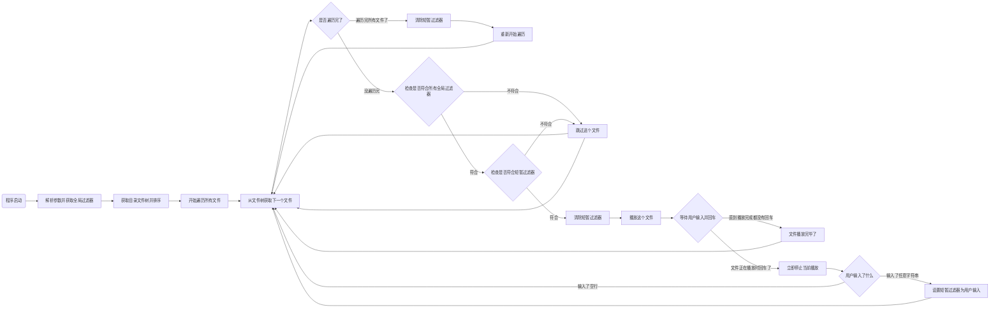

# thiliapr/cli_music_explorer
一个用Python写的命令行音乐播放器，支持智能过滤和后台播放。

## 许可证


thiliapr/cli_music_explorer 是自由软件，遵循 [Affero GNU 通用公共许可证第 3 版或任何后续版本](https://www.gnu.org/licenses/agpl-3.0.html)。你可以自由地使用、修改和分发。

## 这个工具有什么用
- 它可以让你利用 FFplay 对音频格式的支持在后台播放音频
- 它的前端非常简陋，就是一个命令行窗口，指望 GUI 的可以走了，去隔壁自由软件 [DeaDBeeF](https://deadbeef.sourceforge.io/) 吧
- 运行时，你可以通过在命令行窗口键入短暂过滤器并回车，来应用你指定的过滤器，并在达到条件后自动清除，实现音乐跳转
- 如果你什么都不做，那么工具将自动播放下一首音乐

## 快速开始
### 你需要什么
- Python 3.9 或更高版本（因为使用了泛型）
- ffplay，确保它在 PATH 里。你可以[官网](https://ffmpeg.org/download.html)看看下载链接
- 一个装满音乐文件的文件夹

### 安装
```bash
git clone https://github.com/thiliapr/cli_music_explorer.git
cd cli_music_explorer
```

### 启动
```bash
# 启动播放器，默认播放当前文件夹的音乐
cd "~/Music/2020.03.22 眠りのピアノ 花 [例大祭17]"
python /path/to/cli_music_explorer/player.py
# 指定音乐文件夹
python player.py -r "~/Music/WindAge"
# 设置全局过滤器: 只播放文件名带有 `natsuiro_matsuri` 的文件
# 你问我 -f 是什么？看后面
python player.py -f "Substring:natsuiro_matsuri"
```

### 其他
- 如何退出: Ctrl+C
- 我想播放下一首歌曲: 回车
- 我想跳转到指定的歌曲: 输入过滤器并回车。通过这样，应用该过滤器作为短暂过滤器，直到找到第一个符合条件的文件为止

## 工作流程


## 过滤器
### 温馨提醒
这部分比较复杂，不懂的建议丢去问 AI，或者直接不用过滤器了

### 参数形式、支持的类型、如何使用
- 过滤器的参数格式: `FilterName:pos_arg1#type;kwarg_name=value#type`（是不是很像 Python 的函数传参？）
- 支持的参数类型有 `str`、`int`、`float`、`bool`；当参数类型为 str 时，可以不标明类型（示例L `Suffix:.mp3`）
- 可以使用反斜杠 `\` 来转义特殊字符 `:#;=\`，以在参数中使用它们
- 过滤器可以指定 `reverse=true#bool` 来反转过滤逻辑（即跳过符合条件的文件）
- 临时过滤器只会影响当前播放任务，找到符合条件的文件或者一轮目录扫描结束后会被清除，可以在执行程序后的命令行中指定
- 全局过滤器会应用于每个文件的播放判断，可以在命令行参数中指定（`-f`或 `--filter`），并且可以添加多个

### 过滤器列表
- Suffix: 根据文件后缀名过滤文件
  - 参数格式为 `Suffix:<suffix1>;<suffix2>;<suffix3>;...;reverse=<bool>#bool`
  - 注意，这里的后缀名需要包含点号且使用小写字母，匹配的文件后缀名不分大小写（因为在 Suffix 实现中使用了 file.suffix.lower() in suffixes，需要匹配小写的后缀）
- Prefix: 根据文件名前缀过滤文件
  - 参数格式为 `Prefix:<prefix1>;<prefix2>;<prefix3>;...;reverse=<bool>#bool`
  - 注意，匹配时区分大小写
- Substring: 根据文件名包含的子字符串过滤文件
  - 参数格式为 `Substring:<substring1>;<substring2>;<substring3>;...;reverse=<bool>#bool`
  - 注意，匹配时区分大小写
- Path: 根据文件路径前缀过滤文件
  - 参数格式为 `Path:<path1>;<path2>;<path3>;...;reverse=<bool>#bool`
  - 参数为一个相对与 `--root` 指定目录路径的子字符串，Posix 风格（统一 Windows 和 Unix 路径分隔符为 `/`）
  - 注意，匹配时区分大小写

### 用法示例
- 只播放 `.flac`、`.ogg` 和 `.webm` 文件
  - `Suffix:.flac;.ogg;.webm`
- 跳过文件名以 `[WIP]` 开头的文件
  - `Prefix:[WIP];reverse=true#bool`
- 跳过播放文件名包含 `[live]`、`[Live]` 或 `[LIVE]` 的文件
  - `Substring:[live];[Live];[LIVE];reverse=true#bool`
- 只播放路径以 `touhou/ha04` 开头的文件
  - `Path:touhou/ha04`
- 跳过所有文件，重新开始循环
  - `Path:/`
  - 注意事项: 只应用于短暂过滤器，否则运行程序无歌曲播放
  - 技术原理
    - 我们上面已经说过，Path 检测的是相对路径，你见过谁家相对路径以 `/` 开头吗？所以该过滤器必定对所有文件返回 False
    - 该短暂过滤器会一直持续到循环结束，然后被清除，再然后就会开始新一轮循环
  - PS: 其实你也可以换成 `Prefix` / `Substring` / `Suffix` 这些过滤器，一样效果。但是我用 `Path` 的原因是它只有 4 个字母，比其他过滤器都短
- 快速跳转到指定歌曲
  - 使用 `Path`/`Prefix`/`Substring` 任意一个过滤器，然后根据指定歌曲的特征（比如歌手、歌曲名、路径等）
    - 知道路径（比如 `vtb/live/asmr`）: `Path:vtb/live/asmr`
    - 知道前缀（比如 `ZUN -`）: `Prefix:ZUN -`
    - 知道字串（比如 `[2023]`）: `Substring:[2023]`
- 跳转到上一首歌曲
  - 分两步
    1. `Path:/`
    2. `Path:<从终端复制上一首歌的完整相对路径>`
  - 解释
    1. 从头播放整个播放列表
    2. 跳转到路径<从终端复制上一首歌的完整相对路径>

### 默认的全局过滤器
- `Suffix:.mid;reverse=true#bool`
  - 作用: 全局过滤器，跳过所有 .mid 文件
  - Why? 因为我试过用 FFplay 播放 MIDI 文件，那声音……老带感了！耳朵差点废掉
  - 如果你很自信你能扛得住，请去代码把这个过滤器删掉
